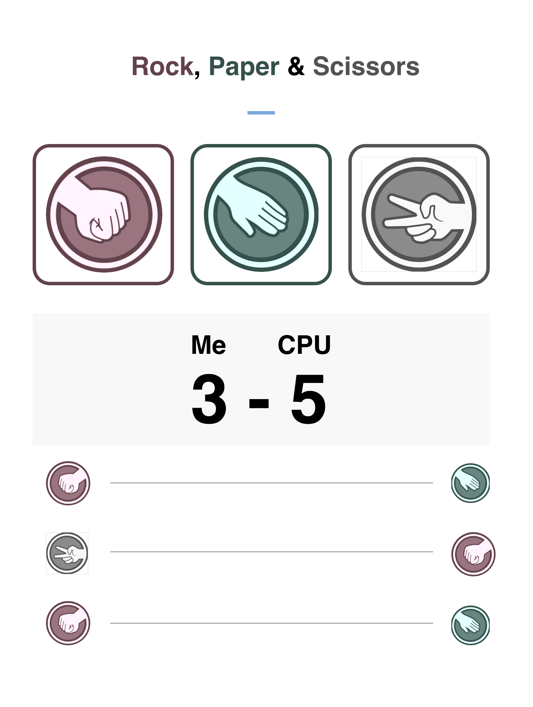

# Rock, Paper & Scissors

A simple webapp created using React.js



## To start your App

* Clone the repository
* Install dependencies with `npm install`
* Start the app with `npm run start`

Now you can visit `http://localhost:3000` from your browser.

## DEMO

[LIVE](https://hecto932.github.io/rock-paper-scissors)

### Note
You will be using `https://smartplay.afiniti.com/v1/play/` API in order to play with CPU.
You can send the history of all your plays at the end of the endpoint like this:

```
https://smartplay.afiniti.com/v1/play/R

https://smartplay.afiniti.com/v1/play/RP

https://smartplay.afiniti.com/v1/play/RPP

https://smartplay.afiniti.com/v1/play/RPPS

#...etc
```
